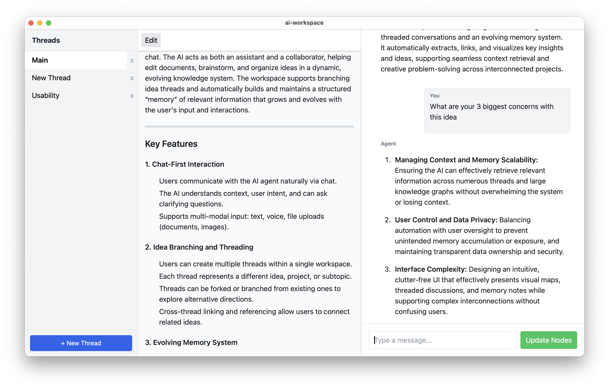

# AI-Native Thinking Workspace

[](LICENSE)
[](https://tauri.app)

An experimental tool for structured, creative, and exploratory thinking — designed to integrate documents, conversations, and memory into a single seamless environment.

Traditional AI tools like ChatGPT are powerful but forgetful. Productivity tools like Notion or Obsidian are flexible but lack context awareness and real-time reasoning. This workspace bridges that gap.

## Core Concepts

At its heart, the system introduces four core components:

- **📄 Documents** — Evolving markdown files for writing, planning, specs, or notes.
- **💬 AI Threads** — Persistent, branchable chat conversations for exploring sub-ideas, alternatives, or rabbit holes.
- **🧠 Memory** — A shared, editable knowledge layer that AI can recall, update, and use for context-aware reasoning.
- **📁 Projects** — Logical workspaces that organize docs, threads, and memory around a central idea.

This architecture enables a workflow where you can:
- Jump between ideas like branches
- Promote useful AI responses into live documents
- Summon past conversations and insights into context
- Work with AI as a long-term thinking partner



---

## Try It Out

### Requirements

- Python 3.11+
- Node.js v18+
- Rust (for building the Tauri desktop app)  
  https://rust-lang.org/tools/install

---

### Setup Instructions

#### 1. Clone the repo
```
git clone https://github.com/wsmartf/ai-workspace.git
cd ai-workspace
```
#### 2. Install backend dependencies (FastAPI)
```
cd server
python3 -m venv venv
source venv/bin/activate
pip install -r requirements.txt
```
#### 3. Install frontend dependencies (Tauri + React)
```
cd ../ui
chmod +x ./scripts/setup.sh
./scripts/setup.sh
```
#### 4. Set your OpenAI API key  
You can either:

- Create a `.env` file with this line:
```
OPENAI_API_KEY=sk-...
```
- Or export it directly:
```
export OPENAI_API_KEY=sk-...
```

---

## ▶Running the App

#### Backend (FastAPI)
```
cd server
uvicorn main:app --reload --port 11434
```

#### Frontend (Tauri Desktop App)
```
cd ui
npm run tauri dev
```

---

## Feedback Welcome

This is an early prototype — I'm actively collecting feedback on:
- Usability
- Bugs or crashes
- Missing features
- Cool ideas

Feel free to open an [issue](https://github.com/wsmartf/ai-workspace/issues), submit a pull request, or reach out directly.

---

## 📄 License

MIT License – see [LICENSE](LICENSE) for details.
